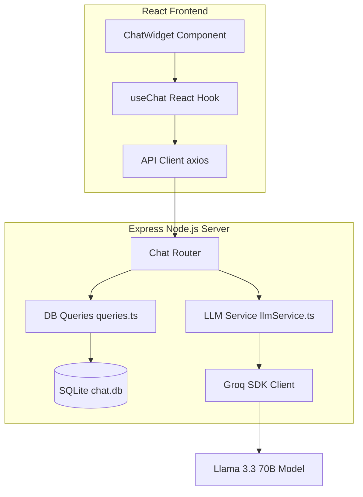

# 🛍️ ShopEase AI Support Agent

A production-ready, full-stack AI-powered customer support chat widget built for the **Spur take-home assignment**. Users can ask questions about the fictional e-commerce store "ShopEase" and receive instant, contextual, and guardrailed replies powered by Llama 3.3 via Groq.

---

## 🚀 Quick Links & Badges

[](#)
[](#)
[](#)
[](#)
[](#)
[](#)
[](#)

* **Live Demo:** [https://spur-chat-omega.vercel.app](https://spur-chat-omega.vercel.app)

---

## ✨ Features

* 🤖 **AI-Powered Customer Support**: Intelligent assistant preset with ShopEase store knowledge (FAQ, shipping, returns, and cancellation policies).
* 💬 **Persistent Chat Sessions**: Automatically resumes conversation history across page reloads using `localStorage`.
* ⚡ **Optimistic UI Updates**: Instantly renders user messages and typing indicators (`...`) for a snappy user experience.
* 🗄️ **Robust Local Database**: Fully automated SQLite schema initialization on backend startup using `better-sqlite3`.
* 🔒 **Security & Validation**:
  * Environment variables validation on startup (fails fast on missing keys).
  * Payload size limits (`10kb` body limit) and message length validation (`1000` chars max) to prevent abuse.
* 🧩 **Clean Layered Architecture**: Modular codebase split into routes, services, and queries on the backend; component-hook model on the frontend.
* 🔄 **Swappable LLM Providers**: Centralized LLM logic makes it easy to switch between OpenAI, Anthropic, or Gemini.

---

## 🏗️ System Architecture

The following diagram illustrates the flow of messages between the frontend interface, backend server, SQLite local database, and Groq's LLM engine:



---

## 📂 Project Directory Structure

```text
spur-chat/
├── backend/
│   ├── src/
│   │   ├── routes/
│   │   │   └── chat.ts            # POST /message & GET /history routes
│   │   ├── services/
│   │   │   └── llmService.ts      # Groq SDK handler, prompt context & fallback rules
│   │   ├── db/
│   │   │   ├── schema.ts          # Table initializers & configurations
│   │   │   └── queries.ts         # SQL queries for conversations and messages
│   │   ├── middleware/
│   │   │   └── errorHandler.ts    # Unhandled error middleware
│   │   ├── config.ts              # Port, Keys, and Node environment state
│   │   └── index.ts               # Server bootstrap & middleware setup
│   ├── .env.example
│   └── package.json
│
└── frontend/
    ├── src/
    │   ├── api/
    │   │   └── chat.ts            # Axios configuration & request functions
    │   ├── components/
    │   │   ├── ChatWidget.tsx     # Main chat layout container
    │   │   ├── MessageList.tsx    # List container with autoscrolling & avatars
    │   │   └── MessageInput.tsx   # Textarea handling input & carriage return sending
    │   ├── hooks/
    │   │   └── useChat.ts         # Hook managing messages, loaders, typing, and sessions
    │   ├── type.ts                # TypeScript interface declarations
    │   ├── App.tsx                # Application Entry Point
    │   └── App.css                # Custom premium stylesheet (Glassmorphism & animations)
    └── package.json
```

---

## ⚙️ Local Setup Guide

### Prerequisites
* Node.js **18 or higher**
* npm
* A Groq API key (Create one for free at the [Groq Console](https://console.groq.com))

---

### Step 1: Clone the Repository
```bash
git clone https://github.com/Kunall7890/spur-chat.git
cd spur-chat
```

---

### Step 2: Backend Setup
1. Navigate to the backend directory:
   ```bash
   cd backend
   npm install
   ```
2. Create a `.env` file in the `backend/` directory:
   ```env
   GROQ_API_KEY=gsk_your_actual_groq_api_key_here
   PORT=3001
   NODE_ENV=development
   ```
3. Run the development server:
   ```bash
   npm run dev
   ```
   **Expected Output:**
   ```text
   ✅ Database initialized
   ✅ Server running on http://localhost:3001
   ✅ Environment: development
   ```
   > **Note**: An SQLite file `chat.db` will be auto-generated in the backend directory.

---

### Step 3: Frontend Setup
1. Open a new terminal session and navigate to the frontend directory:
   ```bash
   cd frontend
   npm install
   ```
2. Create a `.env` file in the `frontend/` directory:
   ```env
   VITE_API_URL=http://localhost:3001
   ```
3. Launch the development server:
   ```bash
   npm run dev
   ```
4. Access the web app in your browser at:
   ```text
   http://localhost:5173
   ```

---

## 🔐 Environment Variables Reference

### Backend Configuration (`backend/.env`)
| Variable | Required | Default | Description |
| :--- | :---: | :---: | :--- |
| `GROQ_API_KEY` | ✅ Yes | *None* | Authentication token for Groq API calls |
| `PORT` | ❌ No | `3001` | Express server port listener |
| `NODE_ENV` | ❌ No | `development` | Environment mode (`development` or `production`) |

### Frontend Configuration (`frontend/.env`)
| Variable | Required | Default | Description |
| :--- | :---: | :---: | :--- |
| `VITE_API_URL` | ✅ Yes | `http://localhost:3001` | Backend API entrypoint URL |

---

## 📡 API Endpoints Specification

### 1. `POST /chat/message`
Send a new user query to get an AI-generated response.

#### **Request Body**
```json
{
  "message": "What is the return policy for sale items?",
  "sessionId": "4db75c9b-6e54-4ca8-9ad5-79a8bc43d0ff" 
}
```
*Note: If `sessionId` is omitted or invalid, the backend automatically registers and returns a new session ID.*

#### **Response Body**
```json
{
  "success": true,
  "reply": "Sale and discounted items are not eligible for returns. Regular items must be unused and returned within 7 days.",
  "sessionId": "4db75c9b-6e54-4ca8-9ad5-79a8bc43d0ff"
}
```

---

### 2. `GET /chat/history/:sessionId`
Retrieve all previous messages for a specific session ID to hydrate the client UI.

#### **Response Body**
```json
{
  "success": true,
  "sessionId": "4db75c9b-6e54-4ca8-9ad5-79a8bc43d0ff",
  "messages": [
    {
      "id": "2db4e3e3-7740-410a-8be7-5fa2c2c034a1",
      "conversation_id": "4db75c9b-6e54-4ca8-9ad5-79a8bc43d0ff",
      "sender": "user",
      "text": "What is the return policy for sale items?",
      "created_at": "2026-06-13T12:00:00.000Z"
    },
    {
      "id": "8aa18e95-7be0-4ca0-94e8-2849e7b233a0",
      "conversation_id": "4db75c9b-6e54-4ca8-9ad5-79a8bc43d0ff",
      "sender": "ai",
      "text": "Sale and discounted items are not eligible for returns. Regular items must be unused and returned within 7 days.",
      "created_at": "2026-06-13T12:00:03.000Z"
    }
  ]
}
```

---

### 3. `GET /health`
Verify server status and connection timestamps.

#### **Response Body**
```json
{
  "status": "ok",
  "timestamp": "2026-06-14T01:00:00.000Z"
}
```

---

## 🗃️ Database Schema Spec
The application uses SQLite as its primary relational datastore. The tables are described below:

```sql
-- Represents individual chat sessions
CREATE TABLE conversations (
    id TEXT PRIMARY KEY,
    created_at TEXT NOT NULL DEFAULT (datetime('now'))
);

-- Represents individual messages within a conversation
CREATE TABLE messages (
    id TEXT PRIMARY KEY,
    conversation_id TEXT NOT NULL,
    sender TEXT NOT NULL CHECK(sender IN ('user', 'ai')),
    text TEXT NOT NULL,
    created_at TEXT NOT NULL DEFAULT (datetime('now')),
    FOREIGN KEY (conversation_id) REFERENCES conversations(id)
);
```

---

## 🧠 LLM System Prompting & Cost Optimization

### Context Limitation
To ensure lightning-fast response times and keep cost-per-request low:
* **Short-Term Memory**: Only the last **10 messages** from the conversation are sent to the model as context.
* **Output Restrictions**: The model is restricted to a maximum output of **300 tokens**.
* **Input Restrictions**: Maximum message length validated to a strict **1000 characters**.

### Prompt Guardrails & Knowledge
The LLM is loaded with a strict system instructions prompt outlining exact details regarding ShopEase operations:
1. **Core Details**: Hours of support (Mon-Sat, 9AM-6PM IST), Contact email (`support@shopease.com`), phone number (`1800-XXX-XXXX`).
2. **Shipping Rules**: Free standard shipping above ₹499 (otherwise flat-rate), shipping restricted inside India.
3. **Return Policy**: 7 days for regular items (unworn/original packaging), sale/discount items excluded.
4. **Behavioral Constraints**: Friendly but concise responses under 100 words. Refuses to make up answers or hallucinate details.

---

## ⚖️ Architecture Trade-offs

* **SQLite vs. PostgreSQL**: SQLite was selected to facilitate zero-configuration setups and zero dependency requirements for evaluation. The codebase abstracts SQL logic into queries files, making migration to postgres/mysql extremely easy.
* **In-Memory Store Rules**: Store knowledge is embedded directly into the system prompt. For larger stores with millions of dynamic SKUs, a Vector Database (RAG) system would be implemented.
* **Stateless Token-based Sessions**: Sessions are stored directly on the client browser and queried against UUID entries in SQLite. Real authentication (OAuth, JWT) was excluded to minimize project scope.

---

## 🚀 Future Enhancements Roadmap
If allocated more time, the following features would be introduced:
1. **Response Streaming**: Leverage server-sent events (SSE) or WebSockets to stream AI replies character-by-character.
2. **RAG Integration**: Link to an external knowledge database/API to answer dynamic product catalog questions.
3. **Redis Caching Layer**: Cache frequent responses to reduce LLM request cost.
4. **Robust Auth**: Multi-tenant authorization systems for agents and store managers.

---

## 🧪 Production Deployment

### Backend Bundle & Run
```bash
cd backend
npm run build
npm start
```

### Frontend Static Build
```bash
cd frontend
npm run build
npm run preview
```

---

## 👨‍💻 Author

**Kunal Jaiswal**
* **GitHub**: [@Kunall7890](https://github.com/Kunall7890)
* **LinkedIn**: [Kunal Jaiswal Profile](https://linkedin.com/in/your-linkedin-profile)

---

## 📄 License
This codebase is created strictly as part of the **Spur Take-Home Assignment**. It is intended solely for evaluation and demo purposes.
